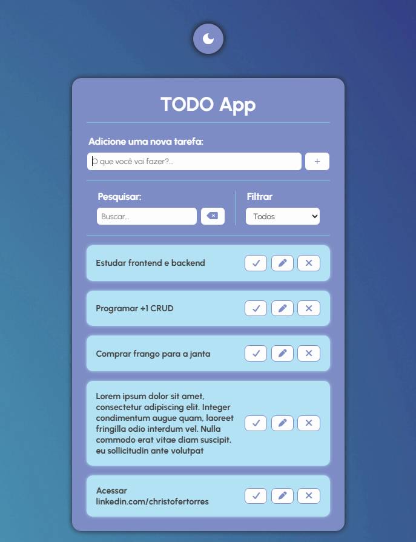
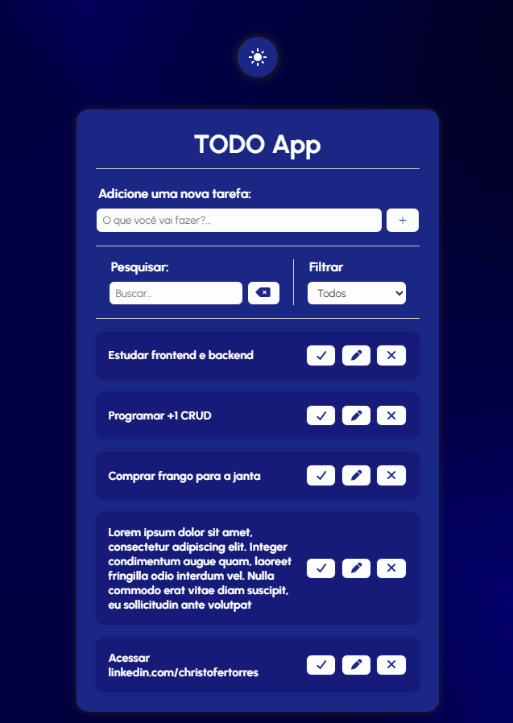

# ✅ TODO App

Aplicação web desenvolvida com HTML, CSS e JavaScript para gerenciamento de tarefas com persistência de dados e suporte a dark mode.

O projeto implementa CRUD completo de tarefas, animações de entrada e saída, troca de tema com transição suave e filtragem dinâmica por status.

## 📸 Preview

 

## 🚀 Demonstração

🔗 Acesse no Vercel: *[Link](https://todo-app-br.vercel.app/)*

## 📄 Funcionalidades

- Criação, edição e remoção de tarefas com animações suaves
- Marcação de tarefas como concluídas
- Filtro por status: todos, feitos e a fazer
- Busca em tempo real por nome da tarefa
- Persistência de dados via localStorage
- Dark mode com transição de background via pseudo-elemento `::before`
- Layout responsivo para tablet e mobile

## 🎯 Conceitos aplicados

- CRUD completo com manipulação do DOM
- Identificação única de tarefas via `Date.now()` para evitar conflitos
- CSS Custom Properties (variáveis) para theming consistente
- Animações CSS com `@keyframes` para entrada e saída de elementos
- Pseudo-elemento `::before` para transição suave entre backgrounds
- `localStorage` para persistência entre sessões
- `animationend` event para remover elemento após animação de saída
- Responsividade com media queries
- Seletor `:not(.hide)` para controle de display sem sobrescrever visibilidade

## 👤 Autor

Desenvolvido por **Christofer Torres**  
Projeto criado para fins de estudo e **portfólio front-end**.